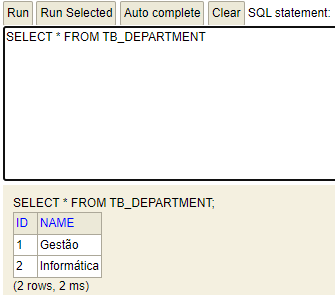
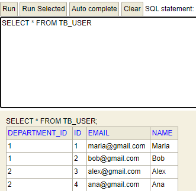
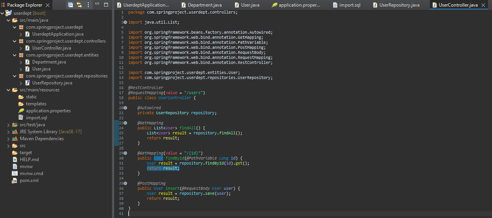
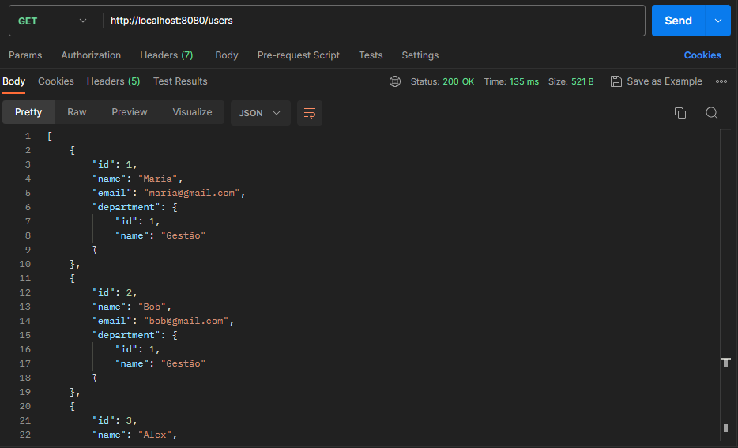
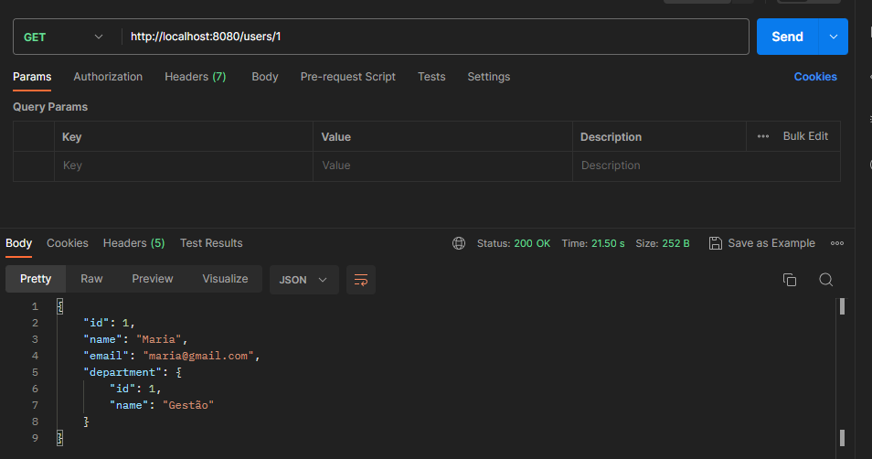
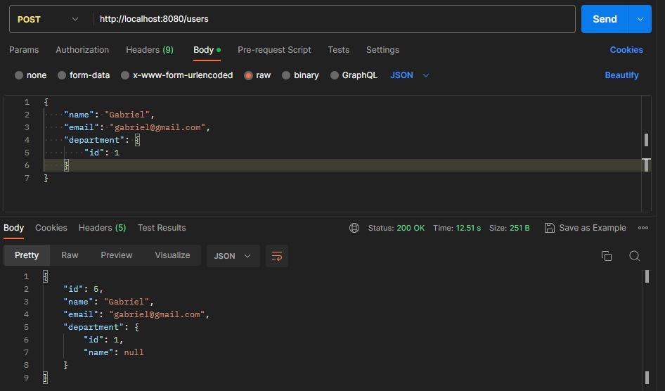
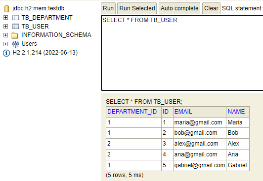

# UserDept-API 

## About the project📜
- Creation of a Spring Boot project of a system (REST API) of users associated with departments, containing functionalities such as user/department registration, user search, primary key search, insertion of new users.
- Visualizing the results through a memory bank (for quick visualization) and Postman (for visualization in Json)

## Technologies used 💻⚙️ 
- Spring Tool Suite 4 
- JDK 17 
- Maven
- Spring Boot 3.1.0 
- JPA 
- H2 Database 
- Postman

## Examples of features/operations
### Code running through H2 database tables
 

### Creating EndPoints

### Testing the service using the Postman tool for viewing in JSON format
#### Searching for users

#### Searching Users by ID

#### Creating a new user

#### New user via database

